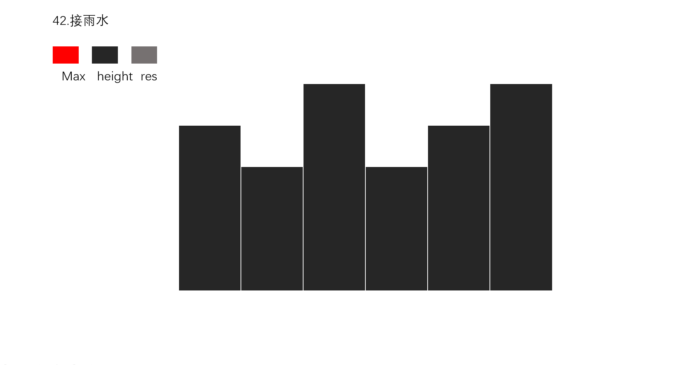
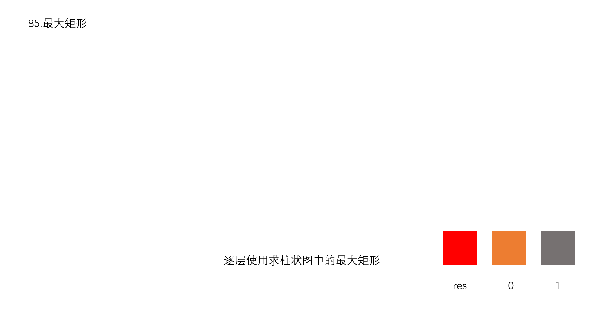
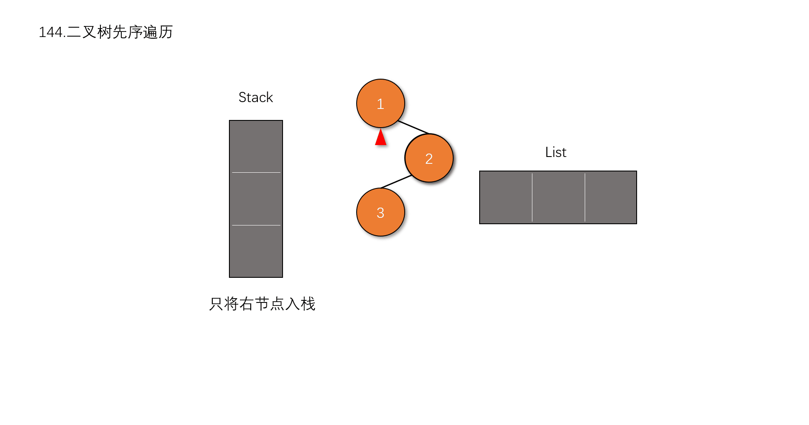
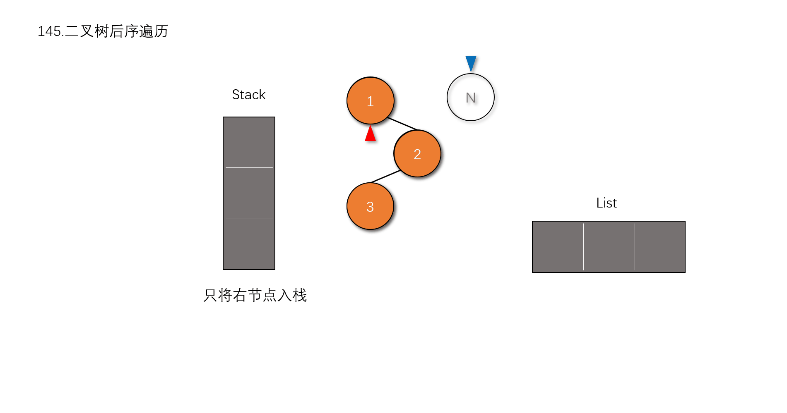

# Leetcode

:smiley: **用来记录一下自己刷题的过程**

    碰到不会的题目可能会跳着刷，列一下已完成的列表

## Navigation

|       Navigation       |  
|:----------------------:|
|  [0 - 49](#0-50)       |
|  [50 - 99](#51-100)    |
|  [100 - 149](#100-149) |
|  [200 - 249](#200-249) |
|  [250 - 299](#250-299) |
|  [351 - 400](#351-400) |
|  [650 - 699](#650-699) |
|  [750 - 799](#750-799) |
|  [800 - 849](#800-849) |

---

## 0-50

`1.` [Two Sum](src/easy/TwoSum.java)

`2.` [Add Two Numbers](src/easy/AddTwoNumbers.java)

`3.` [Longest Substring Without Repeating Characters](src/medium/LongestSubstringWithoutRepeatingCharacters.java)

`4.` [Median of Two Sorted Arrays](src/hard/MedianofTwoSortedArrays.java)

`5.` [Longest Palindromic Substring](src/hard/LongestPalindromicSubstring.java)

`6.` [ZigZag Conversion](src/medium/ZigZagConversion.java)

`7.` [Reverse Integer](src/easy/ReverInteger.java)

`9.` [Palindrome Number](src/easy/PalindromeNumber.java)

`10.` [Regular Expression Matching](src/hard/RegularExpressionMatching.java)

`11.` [Container With Most Water](src/medium/ContainerWithMostWater.java)

`12.` [Integer to Roman](src/medium/IntegertoRoman.java)

`13.` [Roman to Integer](src/easy/RomaToNumber.java)

`14.` [Longest Common Prefix](src/easy/LongestCommonPrefix.java)

`15.` [3Sum](src/medium/ThreeSum.java)

`16.` [3Sum Closest](src/medium/ThreeSumClosest.java)

`17.` [Letter Combinations of a Phone Number](src/medium/LetterCombinationsofaPhoneNumber.java)

`18.` [4Sum](src/medium/FourSum.java)

`19.` [Remove Nth Node From End of List](src/medium/RemoveNthNodeFromEndofList.java)

`20.` [Valid Parentheses](src/easy/ValidParentheses.java)

`21.` [Merge Two Sorted Lists](src/easy/MergeTwoSortedLists.java)

`22.` [Generate Parentheses](src/medium/GenerateParentheses.java)

`23.` [Merge k Sorted Lists](src/hard/MergekSortedLists.java)

`24.` [Swap Nodes in Pairs](src/medium/SwapNodesinPairs.java)

`25.` [Reverse Nodes in k-Group](src/hard/ReverseNodesinkGroup.java)

`26.` [Remove Duplicates from Sorted Array](src/easy/RemoveDuplicatesFromSortedArray.java)

`27.` [Remove Element](src/easy/RemoveElement.java)

`28.` [Implement strStr()](src/easy/ImplementstrStr.java)

`29.` [Divide Two Integers](src/medium/DivideTwoIntegers.java)

`30.` [Substring with Concatenation of All Words](src/hard/SubstringwithConcatenationofAllWords.java)

`31.` [Next Permutation](src/hard/NextPermutation.java)

`32.` [Longest Valid Parentheses](src/hard/LongestValidParentheses.java)

`34.` [Find First and Last Position of Element in Sorted Array](src/medium/FindFirstandLastPositionofElementinSortedArray.java)

`35.` [Search Insert Position](src/easy/SearchInsertPosition.java)

`42.` [Trapping Rain Water](src/hard/TrappingRainWater.java)

`46.` [Permutations](src/medium/Permutations.java)

`47.` [Permutations II](src/medium/PermutationsII.java)

`48.` [Rotate Image](src/medium/RotateImage.java)

`50.` [Pow(x, n)](src/medium/PowXN.java)

[返回目录](#navigation)

## 51-100

`53.` [Maximum Subarray](src/easy/MaximumSubarray.java)

`58.` [Length of Last Word](src/easy/LengthofLastWord.java)

`61.` [Rotate List](src/medium/RotateList.java)

`66.` [Plus One](src/easy/PlusOne.java)

`67.` [Add Binary](src/easy/AddBinary.java)

`69.` [Sqrt(X)](src/easy/SqrtX.java)

`71.` [Simplify Path](src/medium/SimplifyPath.java)

`83.` [Remove Duplicates from Sorted List](src/easy/RemoveDuplicatesfromSortedList.java)

`84.` [Largest Rectangle in Histogram](src/hard/LargestRectangleinHistogram.java)

`85.` [Maximal Rectangle](src/hard/MaximalRectangle.java)

`88.` [Merge Sorted Array](src/easy/MergeSortedArray.java)

`89.` [Parition List](src/medium/ParitionList.java)

`92.` [Reverse Linked Lsit II](src/medium/ReverseLinkedListII.java)

`94.` [Binary Tree Inorder Traversal](src/medium/BinaryTreeInorderTraversal.java)

`100.` [Same Tree](src/easy/SameTree.java)

[返回目录](#navigation)

## 101-149

`101.` [Symmetric Tree](src/easy/SymmetricTree.java)

`102.` [Binary Tree Level Order Traversal](src/medium/BinaryTreeLevelOrderTraversal.java)

`103.` [Binary Tree Zigzag Level Order Traversal](src/medium/BinaryTreeZigzagLevelOrderTraversal.java)

`104.` [Maximum Depth of Binary Tree](src/easy/MaximumDepthofBinaryTree.java)

`107.` [Binary Tree Level Order Traversal II](src/medium/BinaryTreeLevelOrderTraversalII.java)

`110.` [Balanced Binary Tree](src/easy/BalancedBinaryTree.java)

`111.` [Minimum Depth of Binary Tree](src/easy/MinimumDepthofBinaryTree.java)

`118.` [Pascal's Triangle](src/easy/PascalsTriangle.java)

`119.` [Pascal's Triangle II](src/easy/PascalsTriangleII.java)

`136.` [Single Number](src/easy/SingleNumber.java)

`141.` [Linked List Cyle](src/easy/LinkedListCycle.java)

`144.` [Binary Tree Preorder Traversal](src/medium/BinaryTreePreorderTraversal.java)

`145.` [Binary Tree Postorder Traversal](src/hard/BinaryTreePostorderTraversal.java)

[返回目录](#navigation)

## 150-199

`150.` [Evaluate Reverse Polish Notation](src/medium/EvaluateReversePolishNotation.java)

`155.` [Min Stack](src/easy/MinStack.java)

`167.` [Two Sum II - Input array is sorted](src/easy/TwoSumIIInputarrayissorted.java)

`173.` [Binary Search Tree Iterator](src/medium/BinarySearchTreeIterator.java)

`189.` [Rotate Array](src/easy/RotateArray.java)

[返回目录](#navigation)

## 200-249

`203.` [Remove Linked List Elements](src/easy/RemoveLinkedListElements.java)

`206.` [Reverse Linked List](src/easy/ReverseLinkedList.java)

`225.` [Implement Stack using Queues](src/easy/ImplementStackusingQueues.java)

`232.` [Implement Queue using Stacks](src/easy/ImplementQueueusingStacks.java)

`283.` [Move Zeroes](src/easy/MoveZeroes.java)

[返回目录](#navigation)

## 351-400

`387.` [First Unique Character in a String](src/easy/FirstUniqueCharacterinaString.java)

[返回目录](#navigation)

## 650-699

`682.` [Baseball Game](src/easy/BaseballGame.java)

[返回目录](#navigation)

## 750-799

`771.` [Jewels and Stones](src/easy/JewelsandStones.java)

[返回目录](#navigation)

## 800-849

`844.` [Backspace String Compare](src/easy/BackspaceStringCompare.java)

[返回目录](#navigation)

---

*2018.11.29  `updata`*

        1. 修改了整个项目的编码集
        
> 一开始没注意今天用手机`AIDE`的`git`进行`pull`操作的时候，发现乱码了，才知道原来一直没有修改编码集，`eclipse`默认的是`GBK`,折腾了半天，最后找了一个编码转换器，才将工程里所有的class文件转换完毕，解决了乱码问题

        2. 将工程目录的.class\.settings\.target等ignore的文件重新push

> 手机的`AIDE`从`github`拉取到本地的时候不能运行，新建了一个项目进行对比，发现没了.class文件的时候不能自动生成，同时也缺少`.classpath`配置文件，所以又将`git`忽略的文件重新加入了进来，至此，手机上也可以直接进行调试代码并直接`push`到`github`了
