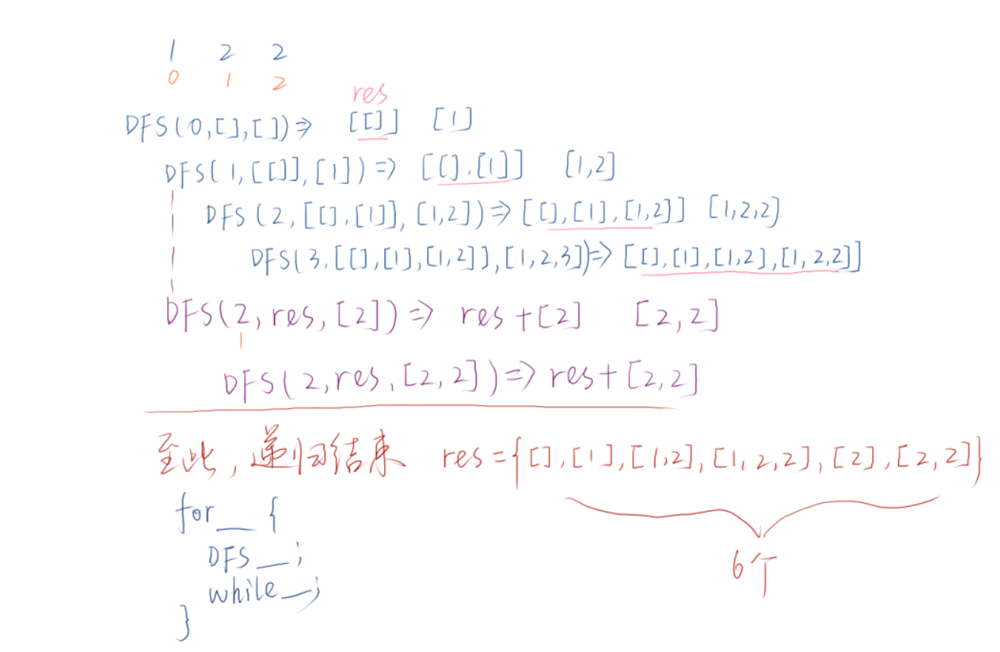
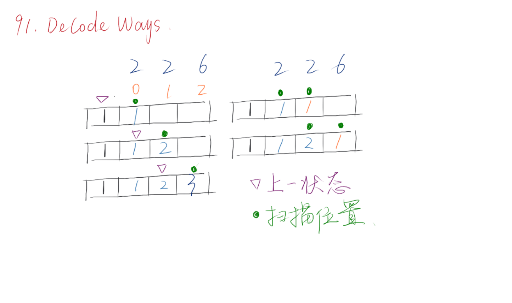
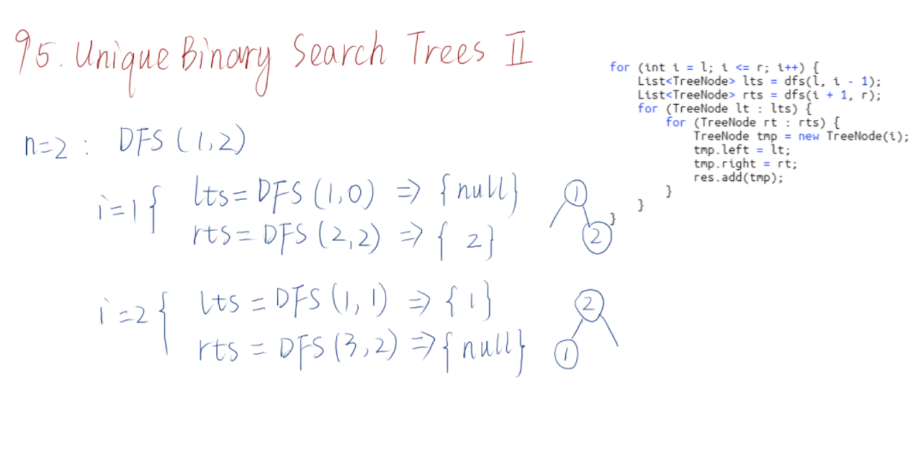
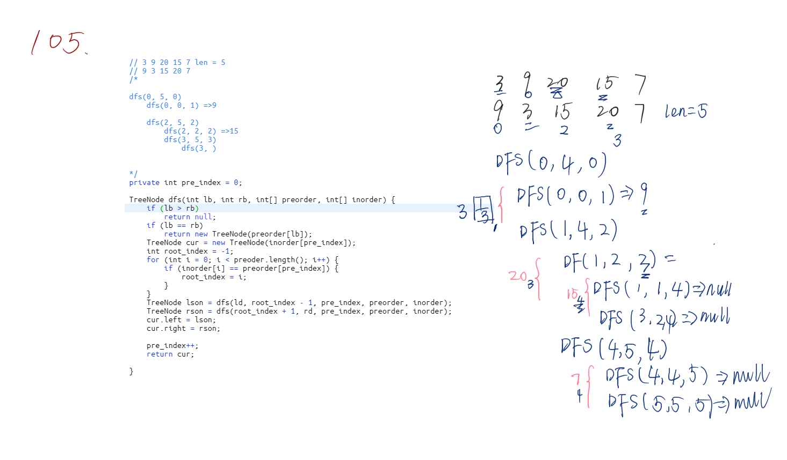
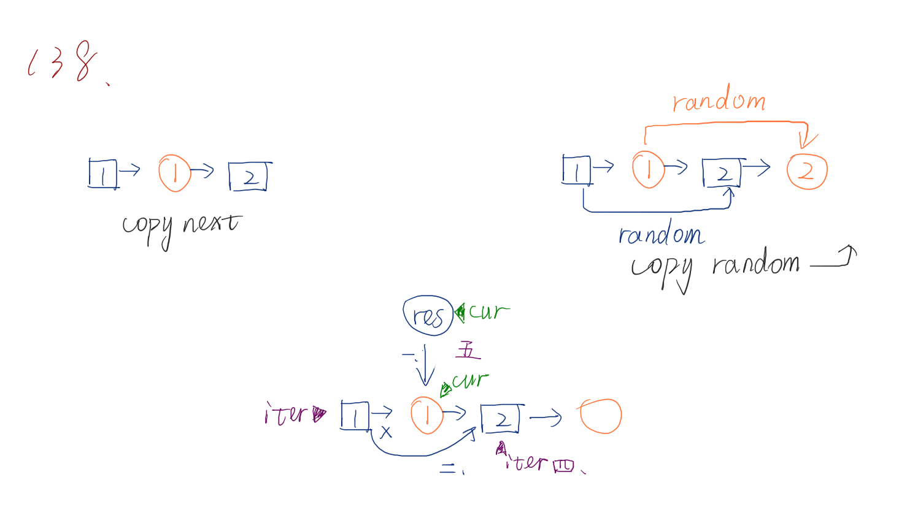
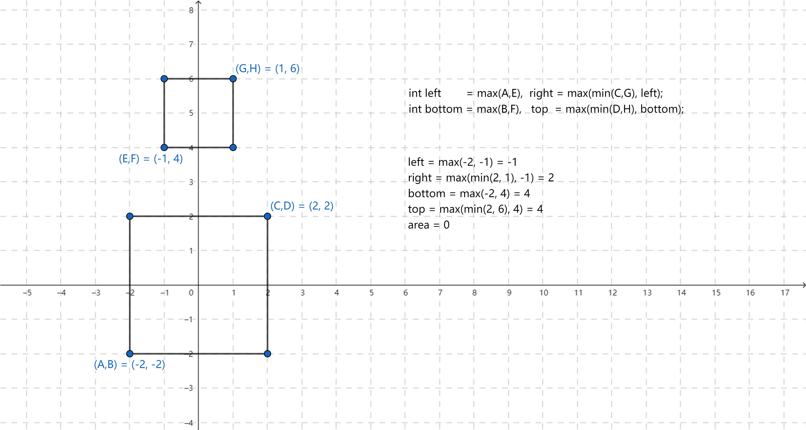

# Leetcode

:smiley: **用来记录一下自己刷题的过程**

    碰到不会的题目可能会跳着刷，列一下已完成的列表

## Navigation

|       Navigation       |  
|:----------------------:|
|  [0 - 49](#0-50)       |
|  [50 - 99](#51-100)    |
|  [100 - 149](#100-149) |
|  [200 - 249](#200-249) |
|  [250 - 299](#250-299) |
|  [350 - 399](#350-399) |
|  [450 - 499](#450-499) |
|  [550 - 599](#550-599) |
|  [650 - 699](#650-699) |
|  [700 - 749](#700-749) |
|  [750 - 799](#750-799) |
|  [800 - 849](#800-849) |

---

## 0-50

`1.` [Two Sum](src/easy/TwoSum.java)

`2.` [Add Two Numbers](src/easy/AddTwoNumbers.java)

`3.` [Longest Substring Without Repeating Characters](src/medium/LongestSubstringWithoutRepeatingCharacters.java)

`4.` [Median of Two Sorted Arrays](src/hard/MedianofTwoSortedArrays.java)

`5.` [Longest Palindromic Substring](src/hard/LongestPalindromicSubstring.java)

`6.` [ZigZag Conversion](src/medium/ZigZagConversion.java)

`7.` [Reverse Integer](src/easy/ReverInteger.java)

`8.` [String to Integer (atoi)](src/medium/StringtoIntegerAtoi.java)

`9.` [Palindrome Number](src/easy/PalindromeNumber.java)

`10.` [Regular Expression Matching](src/hard/RegularExpressionMatching.java)

`11.` [Container With Most Water](src/medium/ContainerWithMostWater.java)

`12.` [Integer to Roman](src/medium/IntegertoRoman.java)

`13.` [Roman to Integer](src/easy/RomaToNumber.java)

`14.` [Longest Common Prefix](src/easy/LongestCommonPrefix.java)

`15.` [3Sum](src/medium/ThreeSum.java)

`16.` [3Sum Closest](src/medium/ThreeSumClosest.java)

`17.` [Letter Combinations of a Phone Number](src/medium/LetterCombinationsofaPhoneNumber.java)

`18.` [4Sum](src/medium/FourSum.java)

`19.` [Remove Nth Node From End of List](src/medium/RemoveNthNodeFromEndofList.java)

`20.` [Valid Parentheses](src/easy/ValidParentheses.java)

`21.` [Merge Two Sorted Lists](src/easy/MergeTwoSortedLists.java)

`22.` [Generate Parentheses](src/medium/GenerateParentheses.java)

`23.` [Merge k Sorted Lists](src/hard/MergekSortedLists.java)

`24.` [Swap Nodes in Pairs](src/medium/SwapNodesinPairs.java)

`25.` [Reverse Nodes in k-Group](src/hard/ReverseNodesinkGroup.java)

`26.` [Remove Duplicates from Sorted Array](src/easy/RemoveDuplicatesFromSortedArray.java)

`27.` [Remove Element](src/easy/RemoveElement.java)

`28.` [Implement strStr()](src/easy/ImplementstrStr.java)

`29.` [Divide Two Integers](src/medium/DivideTwoIntegers.java)

`30.` [Substring with Concatenation of All Words](src/hard/SubstringwithConcatenationofAllWords.java)

`31.` [Next Permutation](src/hard/NextPermutation.java)

`32.` [Longest Valid Parentheses](src/hard/LongestValidParentheses.java)

`33.` [Search in Rotated Sorted Array](src/medium/SearchinRotatedSortedArray.java)

`34.` [Find First and Last Position of Element in Sorted Array](src/medium/FindFirstandLastPositionofElementinSortedArray.java)

`35.` [Search Insert Position](src/easy/SearchInsertPosition.java)

`36.` [Valid Sudoku](src/medium/ValidSudoku.java)

`37.` [Sudoku Solver](src/hard/SudokuSolver.java)

`38.` [Count and Say](src/easy/CountandSay.java)

`39.` [Combination Sum](src/medium/CombinationSum.java)

`40.` [Combination Sum II](src/medium/CombinationSumII.java)

`41.` [First Missing Positive](src/hard/FirstMissingPositive.java)

`42.` [Trapping Rain Water](src/hard/TrappingRainWater.java)

`43.` [Multiply Strings](src/medium/MultiplyStrings.java)

`45.` [Jump Game II](src/hard/JumpGameII.java)

`46.` [Permutations](src/medium/Permutations.java)

`47.` [Permutations II](src/medium/PermutationsII.java)

`48.` [Rotate Image](src/medium/RotateImage.java)

`49.` [Group Anagrams](src/medium/GroupAnagrams.java)

`50.` [Pow(x, n)](src/medium/PowXN.java)

[返回目录](#navigation)

## 51-100

`51.` [N-Queens](src/hard/NQueens.java)

`52.` [N-Queens II](src/hard/NQueensII.java)

`53.` [Maximum Subarray](src/easy/MaximumSubarray.java)

`54.` [Spiral Matrix](src/medium/SpiralMatrix.java)

`55.` [Jump Game](src/medium/JumpGame.java)

`56.` [Merge Intervals](src/medium/MergeIntervals.java)

`57.` [Insert Interval](src/hard/InsertInterval.java)

`58.` [Length of Last Word](src/easy/LengthofLastWord.java)

`59.` [Spiral Matrix II](src/medium/SpiralMatrixII.java)

`60.` [Permutation Sequence](src/medium/PermutationSequence.java)

`61.` [Rotate List](src/medium/RotateList.java)

`62.` [Unique Paths](src/medium/UniquePaths.java)

`63.` [Unique Paths II](src/medium/UniquePathsII.java)

`64.` [Minimum Path Sum](src/medium/MinimumPathSum.java)

`65.` [Vaild Number](src/hard/VaildNumber.java)

`66.` [Plus One](src/easy/PlusOne.java)

`67.` [Add Binary](src/easy/AddBinary.java)

`68.` [Text Justilication](src/hard/TextJustification.java)

`69.` [Sqrt(X)](src/easy/SqrtX.java)

`70.` [Climbing Stairs](src/easy/ClimbingStairs.java)

`71.` [Simplify Path](src/medium/SimplifyPath.java)

`73.` [Set Matrix Zeroes](src/medium/SetMatrixZeroes.java)

`74.` [Search a 2D Matrix](src/medium/Searcha2DMatrix.java)

`75.` [Sort Colors](src/medium/SortColors.java)

`77.` [Combinations](src/medium/Combinations.java)

`78.` [Subsets](src/medium/Subsets.java)

`79.` [Word Search](src/medium/WordSearch.java)

`80.` [Remove Duplicates from Sorted Array II](src/medium/RemoveDuplicatedfromSortedArrayII.java)

`81.` [Search in Rotated Sorted Array II](src/medium/SearchinRotatedSortedArrayII.java)

`82.` [Remove Duplicates from Sorted List II](src/medium/RemoveDuplicatesfromSortedListII.java)

`83.` [Remove Duplicates from Sorted List](src/easy/RemoveDuplicatesfromSortedList.java)

`84.` [Largest Rectangle in Histogram](src/hard/LargestRectangleinHistogram.java)

`85.` [Maximal Rectangle](src/hard/MaximalRectangle.java)

`86.` [Parition List](src/medium/ParitionList.java)

`88.` [Merge Sorted Array](src/easy/MergeSortedArray.java)

`90.` [Subsets II](src/medium/SubsetsII.java)

`91.` [Decode Ways](src/medium/DecodeWays.java)

`92.` [Reverse Linked Lsit II](src/medium/ReverseLinkedListII.java)

`93.` [Restore IP Address](src/medium/RestoreIPAddress.java)

`94.` [Binary Tree Inorder Traversal](src/medium/BinaryTreeInorderTraversal.java)

`95.` [Unique Binary Search Trees II](src/medium/UniqueBinarySearchTreesII.java)

`96.` [Unique Binary Search Trees](src/medium/UniqueBinarySearchTrees.java)

`97.` [Interleaving String](src/hard/InterleavingString.java)

`98.` [Validate Binary Search Tree](src/medium/ValidateBinarySearchTree.java)

`99.` [Recover Bianry Search Tree](src/hard/RecoverBinarySearchTree.java)

`100.` [Same Tree](src/easy/SameTree.java)

[返回目录](#navigation)

## 100-149

`101.` [Symmetric Tree](src/easy/SymmetricTree.java)

`102.` [Binary Tree Level Order Traversal](src/medium/BinaryTreeLevelOrderTraversal.java)

`103.` [Binary Tree Zigzag Level Order Traversal](src/medium/BinaryTreeZigzagLevelOrderTraversal.java)

`104.` [Maximum Depth of Binary Tree](src/easy/MaximumDepthofBinaryTree.java)

`105.` [Construct Binary Tree from Preorder and Inorder Traversal](src/medium/ConstructBinaryTreefromPreorderandInorderTraversal.java)

`106.` [Construct Binary Tree from Inorder and Postorder Traversal](src/medium/ConstructBinaryTreefromInorderandPostorderTraversal.java)

`107.` [Binary Tree Level Order Traversal II](src/medium/BinaryTreeLevelOrderTraversalII.java)

`108.` [Convert Sorted Array to Binary Search Tree](src/easy/ConvertSortedArraytoBinarySearchTree.java)

`109.` [Convert Sorted List to Binary Search Tree](src/medium)

`110.` [Balanced Binary Tree](src/easy/BalancedBinaryTree.java)

`111.` [Minimum Depth of Binary Tree](src/easy/MinimumDepthofBinaryTree.java)

`112.` [Path Sum](src/easy/PathSum.java)

`113.` [Path Sum II](src/medium/PathSumII.java)

`114.` [Flatten Binary Tree to Linked List](src/medium/FlattenBinaryTreetoLinkedList.java)

`116.` [Populating Next Right Pointers in Each Node](src/medium/PopulatingNextRightPointersinEachNode.java)

`117.` [Populating Next Right Pointers in Each Node II](src/medium/PopulatingNextRightPointersinEachNodeII.java)

`118.` [Pascal's Triangle](src/easy/PascalsTriangle.java)

`119.` [Pascal's Triangle II](src/easy/PascalsTriangleII.java)

`120.` [Triangle](src/medium/Triangle.java)

`121.` [Best Time to Buy and Sell Stock](src/easy/BestTimetoBuyandSellStock.java)

`122.` [Best Time to Buy and Sell Stock II](src/easy/BestTimetoBuyandSellStockII.java)

`124.` [Binary Tree Maximum Path Sum](src/hard/BinaryTreeMaximumPathSum.java)

`125.` [Valid Palindrome](src/easy/ValidPalindrome.java)

`126.` [Word Ladder II](src/hard/WordLadderII.java)

`127.` [Word Ladder](src/medium/WordLadder.java)

`128.` [Longest Consecutive Sequence](src/hard/LongestConsecutiveSequence.java)

`129.` [Sum Root to Leaf Numbers](src/medium/SumRoottoLeafNumbers.java)

`130.` [Surrounded Regions](src/medium/SurroundedRegions.java)

`133.` [Clone Graph](src/medium/CloneGraph.java)

`134.` [Gas Station](src/medium/GasStation.java)

`135.` [Candy](src/hard/Candy.java)

`136.` [Single Number](src/easy/SingleNumber.java)

`137.` [Single Number II](src/medium/SingleNumberII.java)

`138.` [Copy List with Random Pointer](src/medium/CopyListwithRandomPointer.java)

`141.` [Linked List Cyle](src/easy/LinkedListCycle.java)

`142.` [Linked List Cycle II](src/easy/LinkedListCycleII.java)

`143.` [Reorder List](src/medium/ReorderList.java)

`144.` [Binary Tree Preorder Traversal](src/medium/BinaryTreePreorderTraversal.java)

`145.` [Binary Tree Postorder Traversal](src/hard/BinaryTreePostorderTraversal.java)

`146.` [LRU Cache](src/hard/LRUCache.java)

`148.` [Sort List](src/medium/SortList.java)

[返回目录](#navigation)

## 150-199

`150.` [Evaluate Reverse Polish Notation](src/medium/EvaluateReversePolishNotation.java)

`151.` [Reverse Words in a String](src/medium/ReverseWordsinaString.java)

`152.` [Maximum Product Subarray](src/medium/MaximumProductSubarray.java)

`153.` [Find Minimum in Rotated Sorted Array](src/medium/FindMinimuminRotatedSortedArray.java)

`154.` [Find Minimum in Rotated Sorted Array II](src/hard/FindMinimuminRotatedSortedArrayII.java)

`155.` [Min Stack](src/easy/MinStack.java)

`160.` [Intersetion of Two Linked Lists](src/medium/IntersectionofTwoLinkedLists.java)

`162.` [Find Peak Element](src/medium/FindPeakElement.java)

`164.` [Maximum Gap](src/hard/MaximumGap.java)

`165.` [Compare Version Numbers](src/medium/CompareVersionNumbers.java)

`166.` [Fraction to Recurring Decimal](src/medium/FractiontoRecurringDecimal.java)

`167.` [Two Sum II - Input array is sorted](src/easy/TwoSumIIInputarrayissorted.java)

`169.` [Majority Element](src/easy/MajorityElement.java)

`171.` [Excel Sheet Column Number](src/easy/ExcelSheetColumnNumber.java)

`172.` [Factorial Trailing Zeroes](src/easy/FactorialTrailingZeroes.java)

`173.` [Binary Search Tree Iterator](src/medium/BinarySearchTreeIterator.java)

`175.` [Combine Two Tables](src/easy/CombineTowTables.sql)

`176.` [Second Highest Salary](src/easy/SecondHighestSalary.sql)

`177.` [NthHighestSalary](src/medium/NthHightestSalary.sql)

`187.` [Repeated DNA Sequences](src/medium/RepeatedDNASequences.java)

`189.` [Rotate Array](src/easy/RotateArray.java)

`190.` [Reverse Bits](src/easy/ReverseBits.java)

`191.` [Number of 1 Bits](src/easy/Numberof1Bits.java)

`198.` [House Robber](src/easy/HouseRobber.java)

`199.` [Binary Tree Right Side View](src/medium/BinaryTreeRightSideView.java)

`200.` [Number of Islands](src/medium/NumberofIslands.java)

[返回目录](#navigation)

## 200-249

`201.` [Bitwise AND of Numbers Range](src/medium/BitwiseANDofNumbersRange.java)

`202.` [Happy Number](src/easy/HappyNumber.java)

`203.` [Remove Linked List Elements](src/easy/RemoveLinkedListElements.java)

`204.` [Count Primes](src/easy/CountPrimes.java)

`205.` [Isomorphic Strings](src/easy/IsomorphicStrings.java)

`206.` [Reverse Linked List](src/easy/ReverseLinkedList.java)

`207.` [Course Schedule](src/medium/CourseSchedule.java)

`208.` [Implement Trie (Prefix Tree)](src/medium/ImplementTriePrefixTree.java)

`209.` [Minimun Size Subarray Sum](src/medium/MinimumSizeSubarraySum.java)

`210.` [Course Schedule II](src/hard/CourseScheduleII.java)

`211.` [AddandSearchSearchWrod-Datastructuredesign](src/medium/AddandSearchWordDatastructuredesign.java)

`212.` [Word Search II](src/hard/WordSearchII.java)

`213.` [House Robber II](src/medium/HouseRobberII.java)

`215.` [Kth Largest Element in an Array](src/medium/KthLargestElementinanArray.java)

`216.` [Combination Sum III](src/medium/CombinationSumIII.java)

`217.` [Contains Duplicate](src/easy/ContainsDuplicate.java)

`219.` [Contains Duplicate II](src/easy/ContainsDuplicateII.java)

`221.` [Maximal Square](src/medium/MaximalSquare.java)

`222.` [Count Complete Tree Nodes](src/medium/CountCompleteTreeNodes.java)

`223.` [Rectangle Area](src/medium/RectangleArea.java)

`224.` [Basic Calculator](src/hard/BasicCalculator.java)

`225.` [Implement Stack using Queues](src/easy/ImplementStackusingQueues.java)

`226.` [Invert Binary Tree](src/easy/InvertBinaryTree.java)

`227.` [Basic Calculator II](src/medium/BasicCalculatorII.java)

`228.` [Summary Ranges](src/medium/SummaryRanges.java)

`229.` [Majority Element II](src/medium/MajorityElementII.java)

`230.` [Kth Smallest Element in a BST](src/medium/KthSmallestElementinaBST.java)

`231.` [Power of Two](src/easy/PowerofTwo.java)

`232.` [Implement Queue using Stacks](src/easy/ImplementQueueusingStacks.java)

`233.` [Number of Digit One](src/hard/NumberofDigitOne.java)

`234.` [Palindrome Linked List](src/easy/PalindromeLinkedList.java)

`235.` [Lowest Common Ancestor of a Binary Search Tree](src/easy/LowestCommonAncestorofaBinarySearchTree.java)

`236.` [Lowest Common Ancestor of a Binary Tree](src/medium/LowestCommonAncestorofaBinaryTree.java)

`237.` [Delete Node in a Linked List](src/easy/DeleteNodeinaLinkedList.java)

`238.` [Product of Array Except Self](src/medium/ProductofArrayExceptSelf.java)

`239.` [Sliding Window Maximum](src/medium/SlidingWindowMaximum.java)

`240.` [Search a 2D Matrix II](src/medium/Searcha2DMatrixII.java)

`242.` [Vaild Anagram](src/easy/VaildAnagram.java)

[返回目录](#navigation)

## 250-299

`257.` [Binary Tree Paths](src/easy/BinaryTreePaths.java)

`258.` [Add Digits](src/easy/AddDigits.java)

`260.` [Single Number III](src/medium/SingleNumberIII.java)

`263.` [Ugly Number](src/easy/UglyNumber.java)

`264.` [Ugly Number II](src/medium/UglyNumberII.java)

`268.` [Missing Number](src/easy/MissingNumber.java)

`274.` [H-Index](src/medium/HIndex.java)

`275.` [H-Index II](src/medium/HIndexII.java)

`278.` [First Bad Version](src/easy/FirstBadVersion.java)

`279.` [Perfect Squares](src/medium/PerfectSquares.java)

`283.` [Move Zeroes](src/easy/MoveZeroes.java)

`284.` [Peek Iterator](src/medium/PeekIterator.java)

`287.` [Find the Duplicate Number](src/medium/FindtheDuplicateNumber.java)

`289.` [Game of Life](src/medium/GameofLife.java)

`290.` [Word Pattern](src/easy/WordPattern.java)

`292.` [Nim Game](src/easy/NimGame.java)

`295.` [Find Median from Data Stream](src/hard/FindMedianfromDataStream.java)

`297.` [Serialize and Deserialize Binary Tree](src/hard/SerializeandDeserializeBinaryTree.java)

`299.` [Bulls and Cows](src/medium/BullsandCows.java)

[返回目录](#navigation)

## 300-349

`300.` [Longest Increasing Subsequence](src/medium/LongestIncreasingSubsequence.java)

`303.` [Range Sum Query - Immutable](src/easy/RangeSumQueryImmutable.java)

`304.` [Range Sum Query 2D - Immutable](src/medium/RangeSumQuery2DImmutable.java)

`306.` [Additive Number](src/medium/AdditiveNumber.java)

`307.` [Range Sum Query - Mutable](src/medium/RangeSumQueryMutable.java)

`309.` [Best Time to Buy ans Sell Stock with Cooldown](src/medium/BestTimetoBuyandSellStockwithCooldown.java)

`313.` [Super Ugly Number](src/medium/SuperUglyNumber.java)

`315.` [Count of Smaller Number After Self](src/hard/CountofSmallerNumberAfterSelf.java)

`316.` [Remove Duplicate Letters](src/hard/RemoveDuplicateLetters.java)

`318.` [Maximum Product of Word Lengths](src/medium/MaximumProductofWordLengths.java)

`319.` [Bulb Switcher](src/medium/BulbSwitcher.java)

`322.` [Coins Change](src/medium/CoinChange.java)

`326.` [Power of Three](src/easy/PowerofTree.java)

`328.` [Odd Even Linked List](src/medium/OddEvenLinkedList.java)

`329.` [Longest Increasing Path in a Matrix](src/hard/LongestIncreasingPathinaMatrix.java)

`330.` [Patching Array](src/hard/PatchingArray.java)

`331.` [Verify Preorder Serialization of a Binary Tree](src/medium/VerifyPreorderSerializationofBinaryTree.java)

`332.` [Reconstruct Itinerary](src/medium/ReconstructItinerary.java)

`334.` [Increasing Triplet Subsequence](src/medium/IncreasingTripletSubsequence.java)

`337.` [House Robber III](src/medium/HouseRobberIII.java)

`338.` [Counting Bits](src/medium/CountingBits.java)

`341.` [Flatten Nested List Iterator](src/medium/FlattenNestedListIterator.java)

`342.` [Power of Four](src/medium/PowerofFour.java)

`343.` [Integer Break](src/medium/IntegerBreak.java)

`344.` [Reverse String](src/easy/ReverseString.java)

`345.` [Reverse Vowels of a String](src/easy/ReverseVowelsofaString.java)

`347.` [Top K Frequent Elements](src/medium/TopKFrequentElements.java)

`349.` [Intersection of Two Arrays](src/easy/IntersectionofTwoArrays.java)

[返回目录](#navigation)

## 350-399

`350.` [Intersection of Two Arrays II](src/easy/IntersectionofTwoArraysII.java)

`354.` [Russian Doll Envelopes](src/hard/RussianDollEnvelopes.java)

`357.` [Count Numbers with Unique Digits](src/medium/CountNumberswithUniqueDigits.java)

`365.` [Water and Jug Problem](src/medium/WaterandJugProblem.java)

`367.` [Valid Perfect Square](src/easy/ValidPerfectSquare.java)

`368.` [Largest Divisible Subset](src/medium/LargestDivisibleSubset.java)

`371.` [Sum of Two Integers](src/easy/SumofTwoInteger.java)

`374.` [Guess Number Higher or Lower](src/easy/GuessNumberHigherorLower.java)

`376.` [Wiggle Subsequence](src/medium/WiggleSubsequence.java)

`380.` [Insert Delete GetRandom O(1)](src/medium/InsertDeleteGetRandomO1.java)

`381.` [Insert Delete GetRandom O(1) - Duplicates allowed](src/hard/InsertDeleteGetRandomO1Duplicatesallowed.java)

`382.` [Linked List Random Node](src/medium/LinkedListRandomNode.java)

`383.` [Ransom Note](src/easy/RansomNote.java)

`384.` [Shuffle an Array](src/medium/ShuffleanArray.java)

`385.` [Mini Parser](src/medium/MiniParser.java)

`386.` [Lexicographical Numbers](src/medium/LexicographicalNumbers.java)

`387.` [First Unique Character in a String](src/easy/FirstUniqueCharacterinaString.java)

`389.` [Find the Difference](src/easy/FIndtheDifference.java)

`390.` [Elimination Game](src/medium/EliminationGame.java)

`391.` [Perfect Rectangle](src/hard/PerfectRectangle.java)

`392.` [Is Subsequence](src/medium/IsSubsequence.java)

`393.` [UTF-8 Validation](src/medium/UTF8Validation.java)

`394.` [Decode String](src/medium/DecodeString.java)

`396.` [Rotate Function](src/medium/RotateFunction.java)

`398.` [Random Pick Index](src/medium/RandomPickIndex.java)

[返回目录](#navigation)

## 400-449

`400.` [Nth Digit](src/easy/NthDigit.java)

`402.` [Remove K Digits](src/medium/RemoveKDigits.java)

`404.` [Sum of Left Leaves](src/easy/SumofLeftLeaves.java)

`405.` [Convert a Number to Hexadecimal](src/easy/ConvertaNumbertoHexadecimal.java)

`406.` [Queue Reconstruction by Height](src/medium/QueueReconstructionbyHeight.java)

`409.` [Longest Palindrome](src/easy/LongestPalindrome.java)

`410.` [Split Array Largest Sum](src/hard/SplitArrayLargestSum.java)

`412.` [Fizz Buzz](src/easy/FizzBuzz.java)

`413.` [Arithmetic Slices](src/easy/ArithmeticSlices.java)

`414.` [Third Maximum Number](src/easy/ThirdMaximumNumber.java)

`415.` [Add Strings](src/easy/AddStrings.java)

`416.` [Partition Equal Subset Sum](src/medium/PartitionEqualSubsetSum.java)

`417.` [Pacific Atlantic Water Flow](src/medium/PacificAtlanticWaterFlow.java)

`419.` [Battleships in a Board](src/medium/BattleshipsinaBoard.java)

`421.` [Maximum XOR of Two Numbers in an Array](src/medium/MaxmiumXORofTwoNumbersinanArray.java)

`423.` [Reconstruct Original Digits from English](src/medium/ReconstructOriginalDigitsfromEnglish.java)

`424.` [Longest Repeating Character Replacement](src/medium/LongestRepeatingCharacterReplacement.java)

`429.` [N-ary Tree Level Order Traversal](src/easy/NaryTreeLevelOrderTraversal.java)

`432.` [All O`one Data Structure](src/hard/AllOoneDateStructure.java)

`434.` [Number of Segments in a String](src/easy/NumberofSegmentsinaString.java)

`435.` [Non-overlapping Intervals](src/medium/NonoverlappingIntervals.java)

`436.` [Find Right Interval](src/medium/FindRightIntervals.java)

`437.` [Path Sum III](src/easy/PathSumIII.java)

`438.` [Find All Anagrams in a String](src/easy/FindAllAngagramsinaString.java)

`441.` [Arranging Coins](src/easy/ArrangingCoins.java)

`442.` [Find All Duplicates in an Array](src/medium/FindAllDuplicatesinanArray.java)

`443.` [String Compression](src/easy/StringCompression.java)

`445.` [Add Two Numbers II](src/medium/AddTwoNumbersII.java)

`447.` [Number of Boomerangs](src/easy/NumberofBoomerangs.java)

`448.` [Find All Numbers Disappeared in an Array](src/easy/FindAllNumberDisappearedinanArray.java)

`449.` [Serialize and Deserialize BST](src/medium/SerializeandDeserializeBST.java)

[返回目录](#navigation)

## 450-499

`450.` [Delete Node in a BST](src/medium/DeleteNodeinaBST.java)

`451.` [Sort Characters By Frequency](src/medium/SortCharactersByFrequency.java)

`452.` [Minimum Number of Arrows to Burst Balloons](src/medium/MinimumNumberofArrowstoBurstBallons.java)

`453.` [Minimum Moves to Equal Array Elements](src/easy/MinimumMovestoEqualArrayElements.java)

`455.` [Assign Cookies](src/easy/AssignCookies.java)

`456.` [132 Pattern](src/medium/Pattern.java)

`459.` [Repeated Substring Pattern](src/easy/RepeatedSubstringPattern.java)

`461.` [Hamming Distance](src/easy/HammingDistance.java)

`463.` [Island Perimeter](src/easy/IslandPerimeter.java)

`468.` [Validate IP Address](src/medium/ValidateIPAddress.java)

`470.` [Implements Rand10() Using Rand7()](src/medium/ImplementsRand10UsingRand7.java)

`474.` [Ones and Zeros](src/medium/OnesandZeros.java)

`476.` [Number Complement](src/easy/NumberComplement.java)

`485.` [Max Consecutive Ones](src/easy/MaxConsecutiveOnes.java)

`496.` [Next Greater Element I](src/easy/NextGreaterElementI.java)

[返回目录](#navigation)

## 550-599

`501.` [Find Mode in Binary Search Tree](src/easy/FinadModeinBinarySearchTree.java)
 
`538.` [Convert BST to Greater Tree](src/easy/ConvertBSTtoGreaterTree.java)
 
`557.` [Reverse Words in a String III](src/easy/ReverseWordsinaStringIII.java)

`563.` [Binary Tree Tilt](src/easy/BinaryTreeTilt.java)

[返回目录](#navigation)

## 650-699

`682.` [Baseball Game](src/easy/BaseballGame.java)

[返回目录](#navigation)

## 700-749

`735.` [Asteroid Collision](src/medium/AsteroidCollision.java)

[返回目录](#navigation)

## 750-799

`771.` [Jewels and Stones](src/easy/JewelsandStones.java)

[返回目录](#navigation)

## 800-849

`844.` [Backspace String Compare](src/easy/BackspaceStringCompare.java)

`860.` [Lemonade Change](src/easy/LemonadeChange.java)

[返回目录](#navigation)

---

*2018.11.29  `updata`*

        1. 修改了整个项目的编码集
        
> 一开始没注意今天用手机`AIDE`的`git`进行`pull`操作的时候，发现乱码了，才知道原来一直没有修改编码集，`eclipse`默认的是`GBK`,折腾了半天，最后找了一个编码转换器，才将工程里所有的class文件转换完毕，解决了乱码问题

        2. 将工程目录的.class\.settings\.target等ignore的文件重新push

> 手机的`AIDE`从`github`拉取到本地的时候不能运行，新建了一个项目进行对比，发现没了.class文件的时候不能自动生成，同时也缺少`.classpath`配置文件，所以又将`git`忽略的文件重新加入了进来，至此，手机上也可以直接进行调试代码并直接`push`到`github`了
